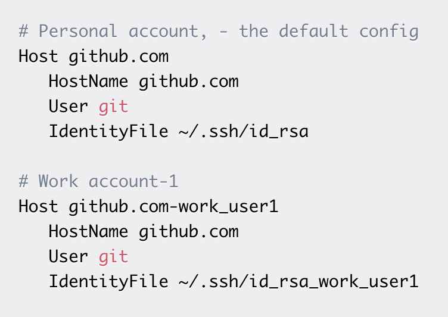
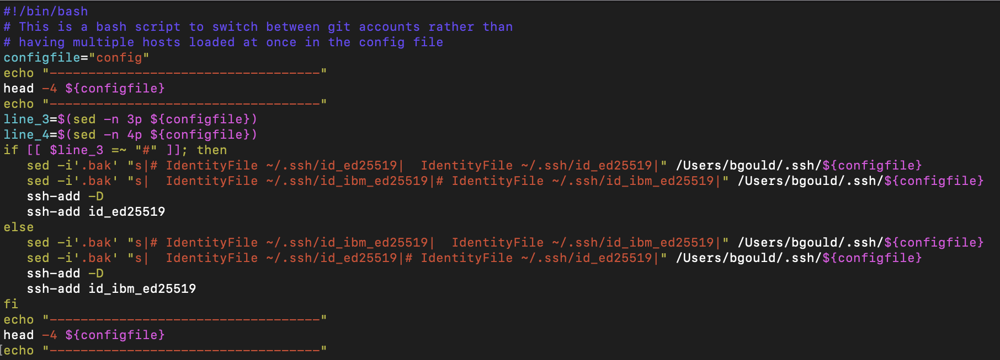
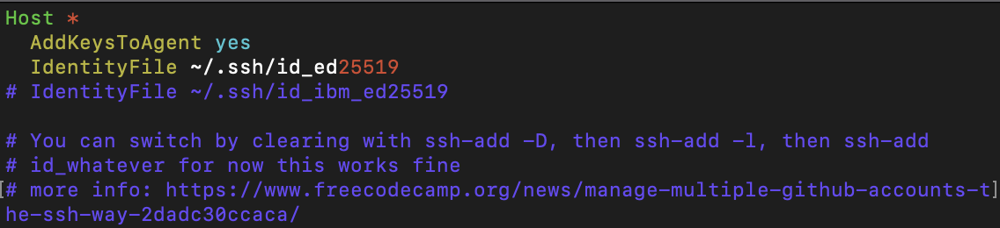

# Using a Bash Script to Switch Git Profiles

## Table of Contents

1. [Overview](#overview)
2. [Explanation](#explanation)
3. [Resoureces](#resoureces)

---

## Overview

So, you got your first software engineering job, and now you need to connect one laptop to two git accounts with their own ssh keys.

While, there is enough documentation on this, I still find myself spending more time than I would like setting it up, particularly if I need to connect GitHub Enterprise with an unknown hostname(s).

The conventional way to fix this is to just modify the <code>config</code> file in the <code>.ssh</code> directory.

Free Code Camp has an excellent [article](https://www.freecodecamp.org/news/manage-multiple-github-accounts-the-ssh-way-2dadc30ccaca/) on this topic if you need a full walk-through on how git works alongside ssh.

In the article, you will see where they show the recommended config file for having multiple git account with their own ssh key:

Personally, this method wasn't doing it for me because when you clone a repo with ssh, you have to remember and manually change the hostname in the url to match the hostname you used in the config file.

So, what do we do when there is a minor inefficiency in our daily tech workflow?

A: We severely overcomplicate the solution and spend a few hours writing a BASH script, naturally!

---

## Explanation

Note: None of the information below must remain private, the only thing you need to keep private is the value in your ssh identity file (the private key).

Also, remember to run <code>chmod u+x &lt;script_name&gt;</code> in order to make your script executable :)

The script:

The config file:

---

Let's break this into digestible pieces:

1. [Shebang](#shebang)
2. [Global variables](#global-variables)
3. [Show me the file before the script](#show-me-the-file-before-the-script)
4. [Script logic](#script-logic)
5. [Show me the file after the script](#show-me-the-file-after-the-script)
6. [Config file](#config-file)

### Shebang

A shebang, #!, is a special character string that tells the program loader to parse the rest of the text file as an interpreter directive - essentially, you need this in order for your script to be executable. 'bin/bash' tells the program loader where to send script. For example, you may choose to use zsh rather than BASH.

### Global Variables

I created one global variable, <code>configFile</code>, here because it allowed me to test my script on a test script in the local directory without potentially messing up my real .ssh config file.

If I wanted to be really nice, I would have also parameterized the identity files, so that you could more easily plug in your file names/paths.

### Show Me The File Before The Script

The <code>head</code> command is one of the most used. Could you use <code>cat</code>? Yes, but it would print the whole file and I keep comments at the bottom of the file that I do not want being printed every time that I run the script. <code>head -4</code> prints the first 4 lines and that is all that I want to see.

### Script Logic

Ah, the fun part. <code>line_3</code> and <code>line_4</code> read in the identity files as shown in the config file image above. A better script would find them via regex, because this current logic requires an exact file structure that could easily break. A better script would also loop through and add them to an array so that it would work for n identity files rather than 2.

Next, I check if line 3 is commented. If it is, my script assumes that line 4 (the other identity file) is not.

Next, we enter the two control blocks, both having the same structure. The logic flow goes: remove the comment from the line that is currently commented out -> comment out the other line -> remove the keys from memory -> add the new, uncommented key to ssh memory.

If you are interesting in learning more about the <code>sed</code> command I posted an article [here](https://www.linkedin.com/pulse/perfectionists-need-learn-sed-bennett-gould/).

<code>fi</code> is just the funny BASH syntax for the end of an if statement - I personally like the symmetry.

### Show Me The File After The Script

Finally, I call <code>head</code> again in order to show the changes that were made to the file for quick reference.

### Config File

I included the config file for reference so that you could see line 3 and 4, as well as why I would want to use <code>head</code> rather than <code>cat</code> so that the comments are not printed.

---

## Resources

[article on sed](https://www.linkedin.com/pulse/perfectionists-need-learn-sed-bennett-gould/)

shebang: https://en.wikipedia.org/wiki/Shebang_(Unix) - thanks for the url encoding problem, Wikipedia (don't put parenthesis in urls)

[run a bash script](https://ss64.com/osx/syntax-shellscript.html)

[multiple git accounts with ssh keys](https://www.freecodecamp.org/news/manage-multiple-github-accounts-the-ssh-way-2dadc30ccaca/)
