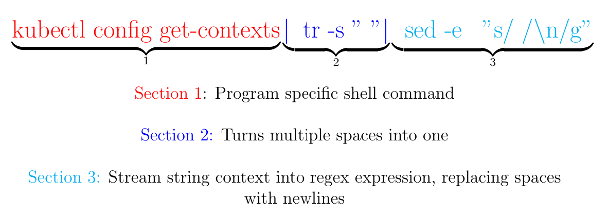

# Perfectionists Need To Learn 'sed'

## Table of Contents

1. [Overview](#overview)
2. [Examples](#examples)
3. [Resoureces](#resoureces)

---

## Overview

The sed command, or Stream EDitor, can be a scary command for terminal beginners, and often an underutilized command for intermediate users. The documentation is quite long, cumbersome, and composed largely of error-related comments.

The command is most commonly used to search, find/replace, or edit a file without the need to open it in an editor. If you thought vim was efficient - with sed you skip vim, and simply pipe the file into sed and re-format accordingly.

So, what's the catch? Like a lot of things in Linux... efficiency requires... regular expresssions.

---

## Examples

1. Sed most recently surfaced for me when working with <code>kubectl</code>, the command utility for managing kubernetes clusters. I did not like how the output was being formatted, so I wanted to columnize it. Sed was the first method that came to mind since I knew I could use regex to find where I wanted insert newlines. [In hindsight, the output was actually formatted correctly - my terminal window was just not wide enough.]

    This is what I came up with:

    <code>kubectl config get-contexts | tr -s " " | sed -e "s/ /\n/g"</code>

    Let's break this command down before moving on to more general examples.

    Markdown can only do so much, so here is an image I generated using LaTeX:

    

    Per the sed docs, <code>-e</code> allows one to pipe input from a shell command into pattern space. If a substitution was made, the command that is found in pattern space is executed and pattern space is replaced with its output.

2. Find and Replace

    >As a quick note, you can also easily test these commands using a string by using the following syntax,
    
    ><code>echo "stringOfYourChoice" | sed -&lt;flag&gt; &lt;regex expression&gt; </code>

    <code>$ sed "s/wordtobereplaced/newword/" examplefile.txt</code>
    - This will only replace the first occurence on each line, this is the default behavior, but not particularly helpful

    Want to specifically replace the 2nd occurence?

    <code>$ sed "s/wordtobereplaced/newword/2" examplefile.txt</code>

    Most likely, you will want to replace all occurences using

    <code>$ sed "s/wordtobereplaced/newword/g" examplefile.txt</code>

3. Perhaps, after you run the command, you wish to see what changed in the terminal. You can use one of the many flags, <code>-n</code>

    <code>$ sed -n "s/wordtobereplaced/newword/p" examplefile.txt</code>

4. From a more destructive standpoint, we can also use sed to delete lines from a file. For example, the following command will delete the 5th line:

    <code>$ sed "5d" examplefile.txt</code>

5. Replace a TAB with 4 spaces

    <code>$ echo -e "1\t2\t3" | sed $'s/\t/    /g'</code>

    And the reverse,

    <code>$ echo -e "1    2" | sed $'s/    /\t/g'</code>

6. Print the lines numbers of a file

    <code>$ sed "=" examplefile.txt</code>

7. What if you want to change the entire file to lowercase?

    That could be done with trace, <code>tr</code>, or even sed, but this is most easily done with <code>awk</code>, another very useful command to have in your toolbox

    <code>echo "UPPER" | awk '{print tolower($0)}'</code>

---

## Resources

1. [GeeksforGeeks](https://www.geeksforgeeks.org/sed-command-in-linux-unix-with-examples/)
2. [linuxhint](https://linuxhint.com/50_sed_command_examples/)